# KacherPonno · কাছের পণ্য

**High-fidelity interactive prototype — CSE 350, Assignment 3.**

A hyper-local O2O search app for Sylhet. Shoppers search for a specialty item and instantly see
which nearby independent shop has it, at what price, and how far away — before leaving the house.
Shops list inventory free and pay ৳500/month for Sponsored placement, analytics and push offers.

---

## Run it

```bash
npm install
npm run dev          # http://localhost:5173
```

No backend, no API keys, no database. All state is in memory (`src/lib/store.jsx`) and persists for
the length of the demo session.

```bash
npm run build && npm run preview   # production build
```

On a laptop the app renders inside a phone frame with a **pitch panel** on the right that shows,
for the screen you're currently on, the validation question it answers — plus jump-to-state
shortcuts for a live demo. On a phone-sized viewport the app goes full-bleed and the same note is
available from the floating **ⓘ** button.

---

## Screen by screen

Eleven states across the two flows. Every screenshot below is captured by driving the real app —
`npm run screenshots` replays the clicks and re-shoots them — so the images can't drift from what the
prototype actually does.

### 1 · Welcome

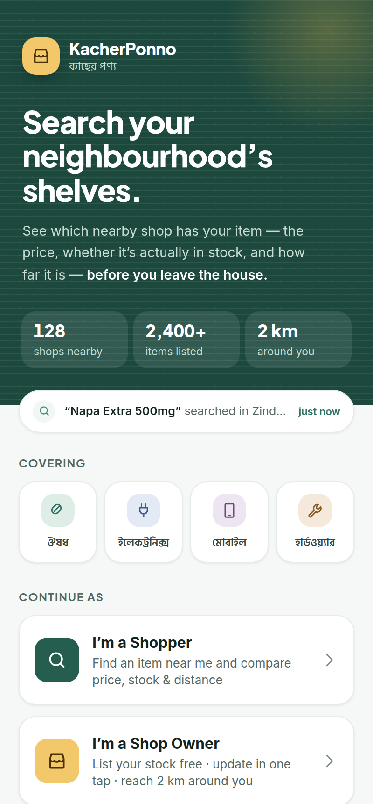

The pitch, stated plainly and then immediately backed with numbers. A ticker cycles real nearby
searches so the local index reads as live, the four categories are shown in Bangla, and the only
decision on the screen is which flow you're in.

- **Two role doors** — Shopper (B2C) or Shop Owner (B2B). Neither audience reads copy meant for the other.
- **Supply proof** — 128 shops · 2,400+ items · 2 km catchment.
- *Answers:* how do people react to "Google Search for your local shelves"?

### 2 · Search

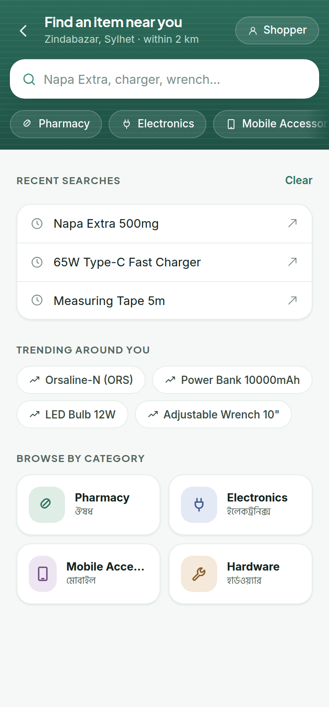
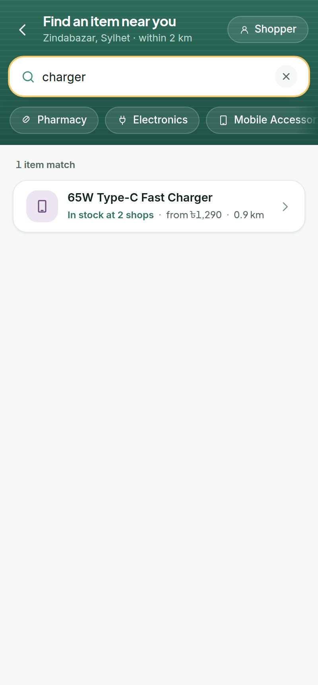

Search is **item-first, not shop-first**, because shoppers start from the product. Typing filters the
real catalogue on every keystroke — the right-hand shot is the same screen after typing "charger".

- **Live suggestions** carry the answer before you commit: *in stock at 2 shops · from ৳1,290 · 0.9 km*.
- **Recent searches** persist for the session and can be cleared; **trending** chips and four
  colour-coded **category tiles** give a start when you don't have a term in mind.
- **Category chips** in the header filter the catalogue and combine with the typed query.
- **Empty state does real work** — if nothing nearby stocks it, "Notify me when available" registers
  an alert and the button flips to a confirmed state instead of leaving a dead end.
- *Answers:* what did you actually do the last time you needed a specialty item?

### 3 · Results

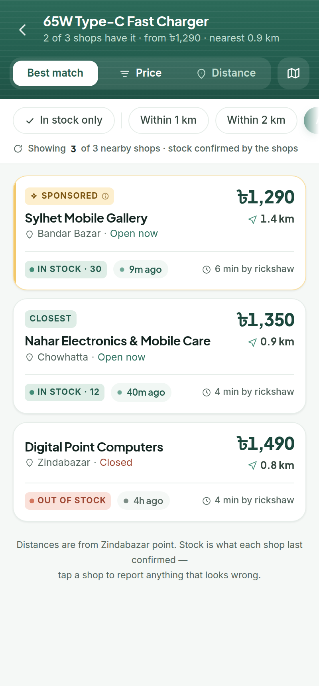

The comparison screen. Price, stock and distance are the three biggest things in every row, and each
row states when the shop last confirmed it.

- **Sponsored is pinned first and labelled** — tapping the label opens a disclosure explaining that
  paying never changes the price, stock or distance you see.
- **Freshness stamp** on every listing (`9m ago`, `4h ago`) with a colour-coded dot.
- **Sort** by best match, price or distance; **filter** by in-stock and by radius (1 km / 2 km / any).
  The counter under the filters updates: *showing 3 of 3 nearby shops*.
- **Automatic tags** mark the lowest price and the closest shop wherever they land.
- **Travel estimate** in the local unit — minutes by rickshaw.
- *Answers:* what do you need to see before you'd tap "Get Directions"?

### 4 · Results — map view

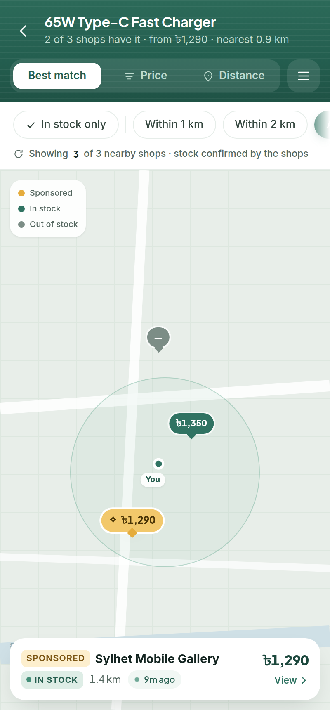

The same result set re-projected onto a lightweight map, for the "is it on my way?" question a list
can't answer.

- **Price pins** coloured by the same three states used everywhere — sponsored, in stock, out of stock.
- Tap a pin to raise a mini card, tap the card to open the shop.

### 5 · Shop Detail

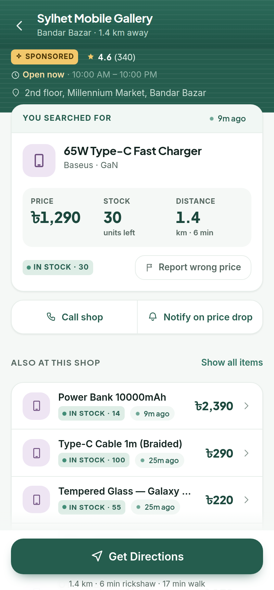

Everything needed to decide to travel, above the fold.

- **The searched item** gets a dedicated block: price, units left and distance as three large figures,
  with the freshness stamp beside it.
- **Get Directions** is a sticky primary action; it opens a route sheet with distance, rickshaw and
  walking times, and a reminder of what the shop confirmed.
- **Call shop** and **Notify on price drop** — the alert is real state and toggles on and off.
- **Also at this shop** lists the rest of the in-stock inventory; tapping any item opens a full price
  comparison for it across every nearby shop.
- *Answers:* what would make you stop using the app?

### 6 · Report a wrong listing

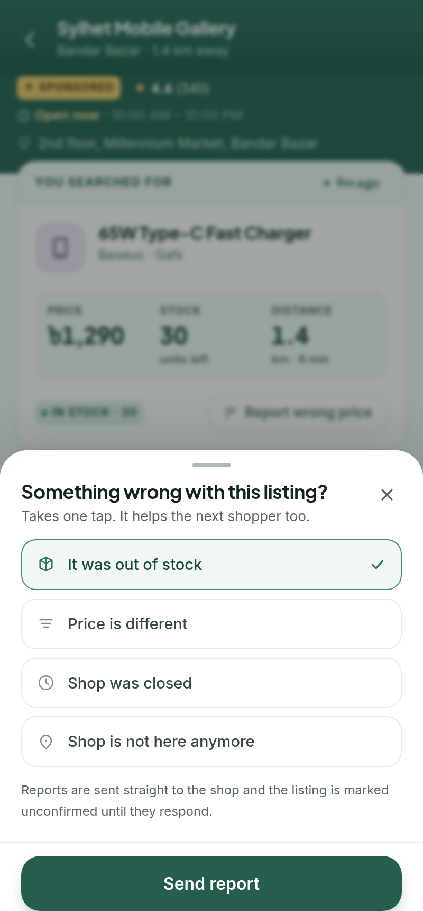

The trust loop. A wasted trip is the churn risk, so a let-down shopper fixes the data instead of
silently leaving.

- Four one-tap reasons: out of stock, price differs, shop closed, shop gone.
- The listing is then **flagged on both the shop detail and the results row**, so the next shopper
  sees the warning too.

### 7 · Inventory Dashboard (shop owner)

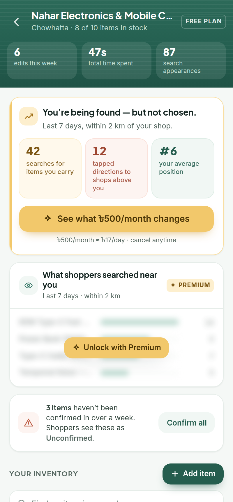

Built around one constraint from the retailer interview: if updating stock is effortful, shopkeepers
abandon the app.

- **One-tap stock toggles** on the row itself. Nothing opens, nothing saves — and the freshness stamp
  resets to *just now*, which is what makes the shopper-side trust signal mean anything.
- **The upsell is quantified, never generic** — *42 nearby searches for items you carry · 12 shoppers
  tapped directions to shops ranked above you · you rank #6*, priced against the fee at ≈৳17/day.
- **Demand analytics** sit locked behind the Premium tier and unlock live when it's switched on.
- **Stale-listing nudge** — *3 items haven't been confirmed in over a week* with a one-tap "Confirm all".
- Search and filter the inventory (all / in stock / out); tap any item name to edit it.
- *Answers:* how many minutes a day would you really spend, and is BDT 500/month worth it?

### 8 · Premium

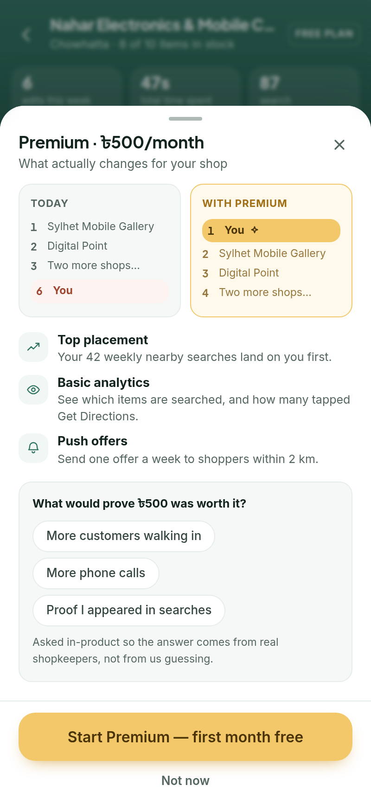

- **Before/after ranking** — you at #6 today, #1 with Premium, shown side by side.
- Top placement, basic analytics and push offers, each tied to a measured number.
- Asks the retailer interview question **in-product**: "what would prove ৳500 was worth it?"
- Subscribing genuinely changes the product: the shop becomes Sponsored and is ranked first with a
  label the next time you search the shopper flow.

### 9 · Add / Update Item

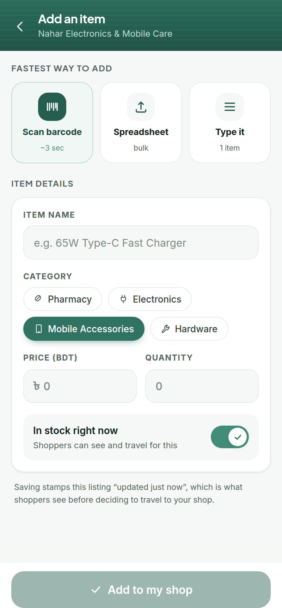
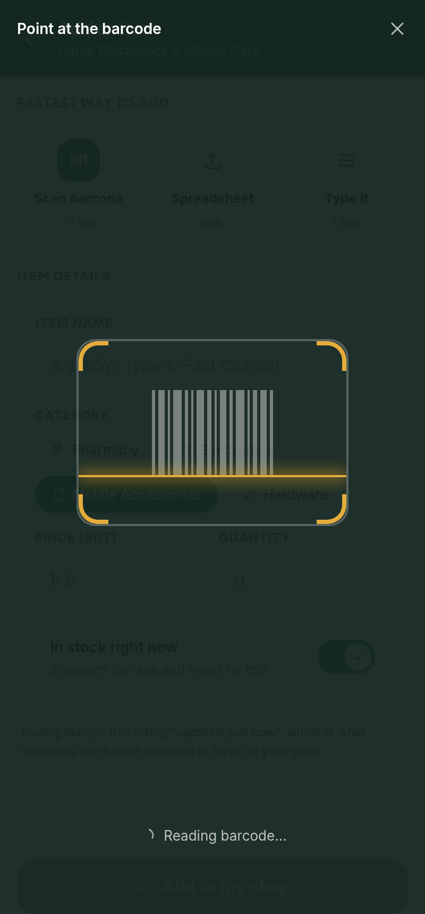

Three ways in, offered as equals because we refuse to assume which one a shopkeeper prefers.

- **Scan barcode** — a simulated scanner (right) resolves a code and auto-fills name, category and a
  suggested price.
- **Spreadsheet** — a simulated CSV import parses rows, previews them and bulk-applies.
- **Type it** — the manual form: name, category, price, quantity, in-stock.
- On save the item appears in the dashboard **and becomes searchable by shoppers**, because both flows
  share one catalogue.
- *Answers:* would you rather scan a barcode, tick items manually, or upload a spreadsheet?

### 10 · Pitch view (laptop)

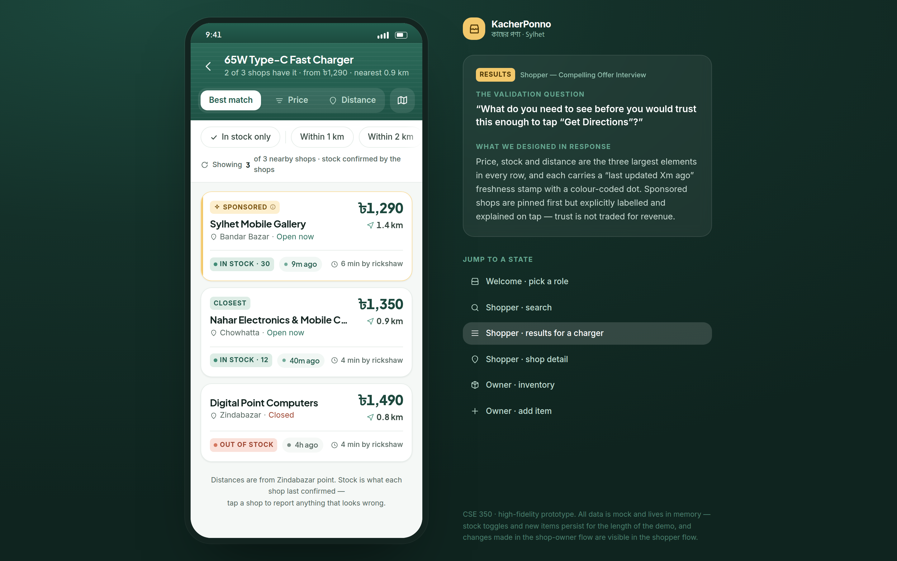

On a laptop the app sits in a phone frame with a panel that names, for whatever screen you're on, the
validation question it answers and the design decision that answers it — plus jump-to-state shortcuts
for a live demo. On a phone the same note is behind the floating **ⓘ** button.

---

## The three things this prototype has to prove

### 1. It functions — it is not six screens linked together

Everything below is real state, not a mock-up of state:

| Interaction | What actually happens |
| --- | --- |
| Typing in search | Filters the live product catalogue; each suggestion computes shops-in-stock, lowest price and nearest distance on the fly |
| Category chips | Filter the same catalogue; combine with the text query |
| Sort (price / distance / best match) | Re-sorts the real result set; sponsored stays pinned and labelled |
| Distance filter (1 km / 2 km / any) | Actually drops shops from the list, and the counter above reports "showing N of M" |
| List ⇄ map toggle | Same data, re-projected onto a mini-map; price pins are tappable |
| "Notify me when available" (empty search) | Registers a real alert; the button flips to a confirmed state instead of leaving a dead end |
| "Notify on price drop" (shop detail) | Same alert store; toggles on and off with visible state |
| Any item under "Also at this shop" | Opens a full price comparison for that item across every nearby shop |
| "Report wrong price or stock" | Writes a report to the store; the listing is then flagged on both the shop detail **and** the results row |
| Stock toggle (owner) | One tap flips `inStock`, zeroes/restores quantity, **and resets the "last updated" stamp to "just now"** |
| "Confirm all" | Bulk-refreshes every stale listing and the nudge disappears |
| Add item | Writes to the shared catalogue — the new item becomes searchable in the shopper flow |
| Scan barcode | Simulated scanner resolves a barcode and auto-fills name, category and suggested price |
| Import spreadsheet | Simulated CSV parse → preview → bulk add/update of several rows |
| Demand analytics (owner) | Real per-item search counts, blurred behind a lock on the free plan and live the instant Premium is switched on — so the upsell is a demonstrable feature, not a marketing line |
| Start Premium | The owner's shop becomes `sponsored: true` — go back to the shopper flow and it is now ranked first with a Sponsored label |

**The two flows share one store.** Toggle the 65W charger out of stock as the shop owner, switch to
the shopper flow, search for it — Nahar Electronics now reads *Out of stock*. This is the single
best thing to show a grader in the live demo.

### 2. It is visually specific, not a default theme

Three hues, each with exactly one job, all deliberately low-chroma — this is an app people open in a
hurry, often outdoors, so it has to stay calm and legible rather than shout.

- **Jade** (`#255D4E`–`#428D77`) — Sylhet tea-garden green. Primary actions, in stock, brand. It is
  the trust colour, so it is never used for anything commercial.
- **Marigold** (`#F2C86B`–`#C98D1E`) — rickshaw art and shop signage. Used *only* for Sponsored and
  Premium, so paid placement is always visually separable from organic results. Notably, the
  freshness indicator does **not** use it: fresh is jade, ageing is plain neutral, unconfirmed is
  clay. Trust must never be confusable with paid placement.
- **Clay** (`#BC5941`) — brick terracotta. Out of stock, wrong listings, lost customers. A warning,
  not a siren.
- **Neutrals** — `canvas #F5F8F6`, `surface #FFFFFF`, `line #E6EDE9`, ink from `#14241F` down to
  `#B8C3BF`, all carrying a faint green cast so nothing looks grey next to the jade.

Every interactive element routes through one button/chip/field class, so hit area (≥36 px), hover,
press, disabled and keyboard focus behave identically everywhere. Focus rings are `focus-visible`
only — keyboard users get a clear ring, mouse users never see a stray outline.
- **Category tints** — pharmacy jade, electronics indigo, mobile plum, hardware umber. Used *only*
  to identify a vertical, never to signal status, so the four categories are separable at a glance
  without diluting the status palette.
- **Type** — a two-face system. **Plus Jakarta Sans** carries headings, prices and every number:
  rounder and more confident at large sizes, which is what gives the screens their retail feel.
  **Inter** carries UI and body text, where it stays legible down to 12px. **Hind Siliguri** carries
  the Bangla wordmark and category labels. Prices, quantities and distances are `tabular-nums` so
  shoppers can compare them down a column.
- **Contrast** — the ink ramp is tuned so every step passes WCAG AA for its intended use: body text
  at 8.9:1, secondary text and section labels at 5.6:1. The lightest step is reserved for icons and
  separators and never carries readable text.
- **Texture** — headers carry a faint corrugated *shutter* pattern, lifted from the roll-down
  shutters of Bandar Bazar.
- **One motion language** — navigation is a horizontal push/pop, sheets rise from the bottom, state
  changes are 150 ms. Nothing else moves. All of it respects `prefers-reduced-motion`.

### 3. It incorporates validation feedback — screen by screen

Each screen answers exactly one interview question. This is also rendered in-app (right-hand panel
on a laptop, ⓘ button on a phone), so it is visible to a grader without reading this file.

| Screen | Validation question | Design decision that answers it |
| --- | --- | --- |
| **Welcome** | *Shopper — Compelling Offer:* how do people react to "Google Search for your local shelves"? | The pitch is stated in the interview's own words and immediately quantified with local supply (128 shops · 2,400 items · 2 km), plus a live ticker of nearby searches. Two role doors, so neither audience reads copy meant for the other. |
| **Search** | *Shopper — Solution:* what did you actually do last time — how many shops did you call or visit? | Search is **item-first**, not shop-first, because people start from the product and end up ringing shops one by one. Every suggestion already carries "in stock at N shops · from ৳X · 0.6 km", so the ring-around is answered before the user even commits to a query. |
| **Results** | *Shopper — Compelling Offer:* what do you need to see before you'd tap "Get Directions"? | Price, stock and distance are the three largest elements in every row, each with a **"last updated Xm ago"** stamp and a colour-coded freshness dot (green &lt;1 h, amber &lt;12 h, grey = unconfirmed). Sponsored rows are pinned first but labelled, and tapping the label explains that paying never changes price, stock or distance. |
| **Shop Detail** | *Shopper — Compelling Offer:* what would make you stop using the app? | The churn risk is a wasted trip, so the searched item's price / quantity / freshness sit above the fold in a three-column block, and **"Report wrong price or stock"** is one tap. A let-down shopper fixes the data instead of silently leaving; reported listings are flagged for the next shopper. |
| **Inventory Dashboard** | *Retailer — Compelling Offer:* how many minutes a day would you really spend, and is ৳500/month worth it? | A stock change is **one tap on the row** — nothing opens, nothing saves. The banner never just says "Go Premium": it states the measured loss (*42 nearby searches this week for items you carry · 12 shoppers tapped directions to shops ranked above you · you rank #6*) and prices it at ≈৳17/day. A stale-listing nudge ties owner effort directly to shopper trust. |
| **Add / Update Item** | *Retailer — Compelling Offer:* barcode, manual, or spreadsheet? | We refuse to assume. All three are equal, first-class paths, and the scanner and CSV import are simulated end to end — so in a real interview we can watch which one a shopkeeper reaches for first. **That observation is the finding; the UI is the instrument.** |

Two extra validation instruments are built into the product rather than bolted on:

- The Premium sheet asks, in-product, *"What would prove ৳500 was worth it?"* with three tappable
  answers — the exact question from the retailer script.
- The spreadsheet import states in the sheet that we want to learn whether shopkeepers actually keep
  a sheet like this.

> **Status of the validation:** the interview scripts are written but have not yet been run with real
> shoppers and retailers in Sylhet. Every decision above is our *anticipated* finding, designed in
> deliberately so the interviews have something concrete to react to. The next milestone is running
> them and recording which of these assumptions survive.

---

## Suggested 3-minute demo path

1. **Welcome** → "I'm a Shopper".
2. Type `charger` → tap **65W Type-C Fast Charger**. Point at the freshness stamps and the Sponsored
   label; tap the label to show the disclosure. Sort by **Price**, then flip to **map**.
3. Open **Sylhet Mobile Gallery** → show the price/stock/distance block → tap **Report wrong price
   or stock** → send. Show the listing now flagged.
4. Back to Welcome → **"I'm a Shop Owner"**.
5. Toggle the **65W Type-C Fast Charger** off. One tap, and the stamp reads *just now*.
6. Show the quantified upsell, then the **locked demand chart** below it → **Unlock with Premium** →
   the before/after ranking → start Premium. The chart unlocks live, and red bars show items shoppers
   wanted while the shop was out of stock.
7. **Add item** → **Scan barcode** → watch the form auto-fill → save → it appears in the list.
8. Switch back to the shopper flow, search the charger again: the shop is now **Sponsored**, and
   reads **Out of stock** because of step 5. Close on that — it proves the two flows are one system.

---

## Project structure

```
src/
  data/mockData.js       Catalogue, 10 Sylhet shops, owner analytics, barcode + CSV fixtures,
                         and the screen → validation-question map
  lib/store.jsx          The single in-memory store shared by both flows
  lib/format.js          BDT formatting, "time ago", freshness tiers, rickshaw/walk estimates
  components/            Icon set, UI kit, mini-map, validation pitch panel
  screens/               Welcome, Search, Results, ShopDetail, Dashboard, ItemEditor
  App.jsx                Phone frame, push/pop navigation stack, pitch panel
docs/screenshots/        The images used above
scripts/screenshots.mjs  Regenerates them by driving the running app
```

### Regenerating the screenshots

```bash
npm run dev                      # terminal 1
npm run screenshots              # terminal 2
```

Uses your local Chrome via `puppeteer-core` — no browser download. Override with
`CHROME_PATH=/path/to/chrome` or `APP_URL=http://localhost:5173/` if your setup differs.

Mock data covers all four categories — Pharmacy (Napa Extra, Seclo, Orsaline, BP monitor),
Electronics (HDMI cable, multimeter, LED bulb), Mobile Accessories (65W charger, power bank,
tempered glass) and Hardware (adjustable wrench, measuring tape, drill bits) — across ten real
Sylhet neighbourhoods: Zindabazar, Chowhatta, Amberkhana, Subid Bazar, Bandar Bazar, Kumarpara,
Mirabazar and Uposhohor. All prices are in BDT (৳).
=======
# high-fidelity-prototype-350-
